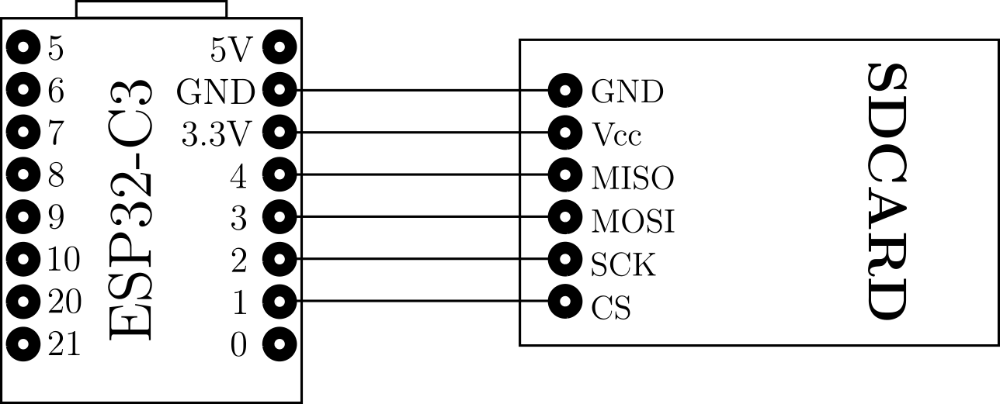

# ESP32-C3-SD-Card

  

  
  

Le script _test_sdcard.py_ donne la liste des éléments présents (fichiers et répertoires) sur la carte SD.

Curieusement, la commande d'initialisation plante systématiquement à la première exécution et doit être relancée,
d'où la séquence _try/except_.
